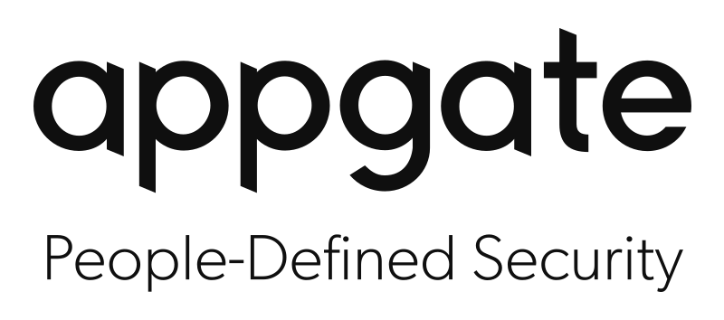

	

# Grafana Dashboards for Appgate SDP
Example monitoring dashboards built with Prometheus and Grafana.

As with most other access devices, Appgate SDP is likely to form a critical part of a company's access infrastructure, therefore it is vital to ensure that:

- the access infrastructure is operating as intended.
- access related appliance functions are performing to the required specification.
- normal operation does not impinge on any physical limits (such as disk space).

It is therefore important to make plans to monitor the Appgate SDP system continuously and where appropriate trigger alerts and take any corrective actions before user access is impacted. The monitoring does not need to be there from the outset as the dashboard includes some basic health check information. However as you scale up the number of users it is important to have monitoring in place to get a clear understanding of how the system is performing.

There is a related [white paper](docs/monitoring_appgate_sdp.pdf) that takes you through the v6.0 examples one-by-one and explaining which metrics matter and the best way to monitor those.